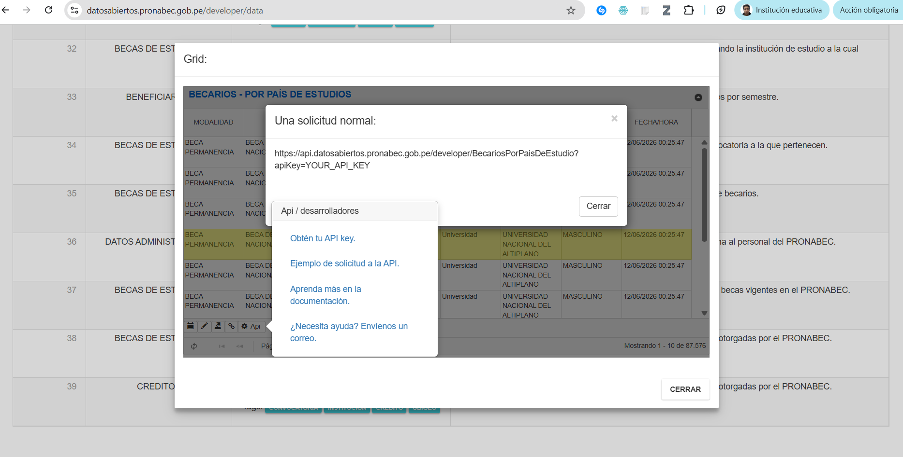
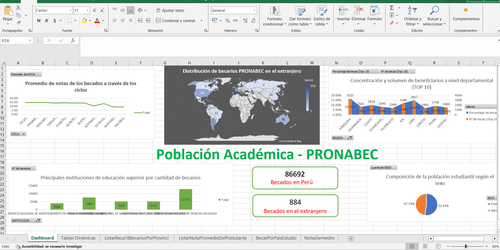

# Dashboard de Becarios - PRONABEC

Este proyecto presenta una solución de análisis de datos desarrollada en Microsoft Excel, optimizada tras diagnosticar y solucionar un problema de conectividad con la API del portal de Datos Abiertos de PRONABEC.

---

### 🚀 Acceso Directo al Proyecto (Excel Cloud)

Puedes interactuar con el Dashboard en tiempo real, con filtros dinámicos y sin necesidad de descargar el archivo, ingresando al siguiente enlace optimizado para navegadores:

👉 [**Abrir Dashboard Interactivo en Excel para la Web**](https://excel.cloud.microsoft/open/onedrive/?docId=FE99D4263DF41BBC%21s33923ccc57984506b23773d5b17383f3&driveId=fe99d4263df41bbc)

---

## 🔍 Diagnóstico Técnico y Análisis de Red (Python)

Durante el planteamiento inicial, se identificó que el endpoint oficial de la API pública provisto en la documentación de PRONABEC generaba errores de conexión al intentar consumirse desde Excel. 

Para resolver el problema, se utilizó un script básico de Python y las herramientas de desarrollador del navegador para inspeccionar las peticiones de red del portal. Se detectó que el sitio web realiza consultas internas a través del plugin `jqGrid`. Este análisis permitió identificar las URL reales del servidor que contienen los datos, superando el bloqueo de la documentación desactualizada.

## 🛠️ Extracción y Procesamiento de Datos (Power Query)

Con las rutas correctas identificadas, todo el flujo de trabajo se trasladó a **Microsoft Excel**:

1. **Conexión Directa:** Se configuró **Power Query** para conectarse a los controladores internos del portal, permitiendo la descarga limpia de la base de datos completa (**87,576 registros históricos**) de becarios por país de estudio, sin lidiar con los límites de paginación de la web.
2. **Transformación (ETL):** Limpieza de registros, tipado correcto de columnas y estandarización de formatos dentro del editor de Power Query.

## 📊 Diseño del Dashboard (Excel)

El cuadro de mando interactivo se consolidó utilizando herramientas nativas de Excel para garantizar una navegación fluida:

* **Tablas Dinámicas y Fórmulas:** Estructuración de las métricas clave del programa de becas.
* **Segmentadores:** Filtros interconectados por género, modalidad de beca e institución de destino.
* **Optimización Web:** Uso de un diseño de fondo oscuro y gráficos de mapa configurados para mantener un alto rendimiento tanto en local como en su visualización en la nube.

